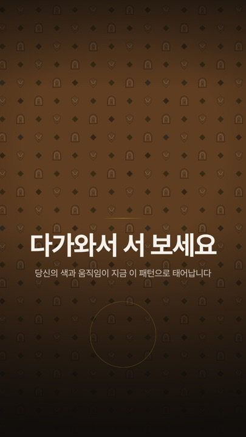
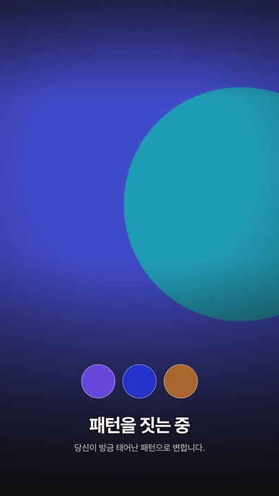
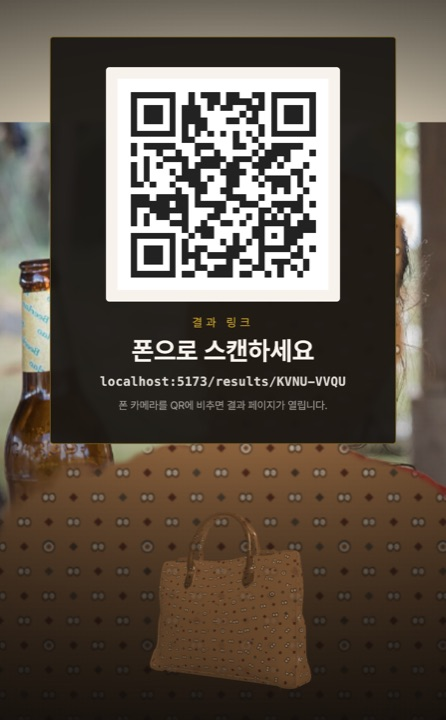

# 리빙 비세토스 (Living Visetos)

> **관객이 서면 패턴이 태어나고, 그 패턴이 가방이 된다.**
> 카메라 앞에 선 사람의 색·움직임·리듬이 그 사람만의 패턴이 되어, 실루엣과 3D 가방에 실시간으로 입혀지고, QR로 폰에 배달되는 **무인 키오스크 체험**입니다.

팀 **빽빽한하마** · 라이브 데모 **https://visetos.w00.kr**

| ATTRACT — 유휴 무대 | TRANSFORM — 씨앗 색 추출 | OWN — QR 전달 |
| :---: | :---: | :---: |
|  |  |  |

## 체험 여정 (90초, 완전 무인)

```
ATTRACT(유휴 패턴 루프) → CONSENT(카메라 동의) → CREATE(색·움직임 추출)
→ TRANSFORM(패턴 탄생 + 실루엣 오버레이) → MATERIALIZE(3D 가방에 입히기)
→ OWN(패턴 이름 짓기 → 8초 세로 영상 녹화 → QR 배달) → RESET(세션 완전 파기)
```

모든 상태에 무인 운영 타임아웃이 걸려 있고, 관객이 사라져도 화면은 스스로 처음으로 돌아갑니다.

## 무엇이 특별한가

- **로컬 우선, 폴백 3단** — 체험의 핵심 경로는 인터넷 없이 완주됩니다. 세그멘테이션 모델·wasm·폰트까지 전부 로컬 번들. 업로드가 실패하면 오프라인 코드를 발급하고 복구 시 자동 재전송, 카메라가 죽으면 운영자 단축키로 데모 모드, 전체 장애면 폴백 영상 — [폴백 매트릭스](docs/ARCHITECTURE.md).
- **계약이 국경인 5모듈 아키텍처** — 비전(A)·패턴(B)·렌더(C)·결과물(D)·앱셸(E)이 [`src/contracts.ts`](src/contracts.ts)의 타입으로만 대화합니다. 5인이 병렬로 개발하고 PR 9개로 합류했습니다.
- **패턴은 문법이다** — L1 프로시저럴 엔진이 시드(색 3 + 모션 + 리듬 + 세션)를 결정론적 문법으로 변환합니다. 같은 사람·같은 순간이면 픽셀까지 같은 패턴, 다른 세션이면 다른 변주. 브랜드 문자·로고를 그리지 않는 가드레일과 관객색 35% 혼합 상한을 코드로 강제합니다. 생성AI 승격(L2) 경로도 배선돼 있습니다(8초 타임아웃, 실패 시 무반응 — 관객은 기다리지 않습니다).
- **프라이버시 by design** — 원본 카메라 프레임은 어디에도 저장되지 않습니다. 특징값·마스크·결과물만 존재하고, RESET이 세션 메모리를 통째로 파기합니다. 동의(CONSENT)는 상태머신의 정식 상태입니다.
- **세로 비디오월 무대** — 1080×1920 관객용 무대 화면이 기본 모드입니다. 녹화 결과물도 무대와 같은 그림의 세로 8초 mp4로 합성됩니다.

## 기능

| ID | 기능 | 상태 |
| --- | --- | --- |
| F-01 | 모션·컬러 특징 추출 (조명 정규화·인물 영역 샘플링) | ✅ |
| F-02 | L1 프로시저럴 패턴 엔진 + Grammar Guard (+ L2 생성AI 배선) | ✅ |
| F-03 | 실시간 실루엣 오버레이 (WebGL 셰이더, 경계 페더링) | ✅ |
| F-04 | 3D 가방 프리뷰 (GLTF + 패턴 UV 텍스처 스왑) | ✅ |
| F-05 | 결과물 전송 — 세로 8초 영상 + QR + 오프라인 코드 폴백 | ✅ |
| F-06 | 공개 결과 페이지 + 굿즈 목업 주문 | ✅ |
| F-07 | 한정판 드랍 페이지 (목업 — 실제 L1 엔진 렌더) | ✅ |
| F-08 | 멤버십 패턴 진화 컨셉 화면 | ✅ |
| F-09 | 운영 대시보드 (토큰 인증) | ✅ |

## 실행

```bash
npm ci && npm run dev        # http://localhost:5173  ← 관객용 무대 (카메라 허용)
```

- `/?debug=1` — 모듈별 디버그 계기판 (버튼 1개 = 모듈 1개 = 계약 핸드오프 1개)
- `/admin.html` — 운영 대시보드 · `/drop.html` `/membership.html` — F-07/08
- `/?mockCamera=1` — 카메라 없이 여정 완주 (개발 전용)
- 검증: `npm run typecheck && npm test && npm run build` (CI가 모든 push·PR에서 동일하게 실행)

**데모데이 키오스크**: `npm run build && npm run preview` 후
`chrome --kiosk --autoplay-policy=no-user-gesture-required http://localhost:4173`
카메라는 행사 전 미리 1회 허용. 현장 운영 단축키(Shift+D 데모 모드 / Shift+R 강제 리셋 / Shift+F 폴백 영상)와 수습 절차는 [`docs/OPERATIONS.md`](docs/OPERATIONS.md).

**배포**: CloudFront(HTTPS) → 자체 서버(Node 22, systemd) → Supabase(저장). 재배포는 `scripts/deploy.sh` 한 번. 절차·env는 [`cloud/README.md`](cloud/README.md).

## 아키텍처

```
src/
├─ contracts.ts    ★ 모듈 간 국경 — 변경은 팀 합의 + 리뷰 2인
├─ vision/    A 캡처·세그멘테이션(tasks-vision 로컬)·씨앗 추출
├─ pattern/   B L1 문법 엔진·Grammar Guard·L2 승격 게이트
├─ render/    C WebGL 실루엣 오버레이·GLTF 가방
├─ output/    D 세로 녹화·업로드·재시도 큐·QR
└─ app/       E 상태머신·키오스크 여정·무대 화면·운영 단축키
api/          결과·주문 API (자체 서버·Vercel 겸용 웹 핸들러)
```

| 문서 | 내용 |
| --- | --- |
| [`docs/ARCHITECTURE.md`](docs/ARCHITECTURE.md) | 설계 원칙 4 · 상태머신 · ADR 7건 · 성능 예산 · 폴백 매트릭스 |
| [`docs/DEV_SETUP.md`](docs/DEV_SETUP.md) | 모듈 분담 · 협업 규칙 · 걷는 스켈레톤 킥오프 |
| [`docs/OPERATIONS.md`](docs/OPERATIONS.md) | 현장 운영 · 단축키 · 폴백 영상 준비 |
| [`docs/skeleton_v0.html`](docs/skeleton_v0.html) | 이 리포가 태어난 v0 걷는 스켈레톤 (단일 파일 실행 가능) |
| [`DESIGN.md`](DESIGN.md) | 웹 서피스 디자인 토큰 (무대는 비세토스 무드 별도 트랙) |

**스택**: Vite + TypeScript(프레임워크 无) · three.js · MediaPipe tasks-vision(로컬 번들) · MediaRecorder · Supabase · Node 22 자체 서버 + CloudFront

**성능 실측**: 세그멘터 초기화 98ms · 씨앗 추출 ~500ms(예산 1.5s) · L1 타일 ~2ms(예산 0.8s) · 마스크 스트림 65–100fps@720p(예산 24) · 세션 최악 82s(예산 90s)

## 팀 빽빽한하마

| 모듈 | 담당 |
| --- | --- |
| A 비전·캡처 (F-01) | PO |
| B 패턴 엔진 (F-02) | 팀원① |
| C-1 오버레이 (F-03) | 팀원② |
| C-2 3D 가방 (F-04) | 팀원③ |
| D 결과물·웹 (F-05·06·09) | 팀원④ |
| E 앱셸·무대·운영 | 공동 |

*걷는 스켈레톤 → 계약 → 모듈 교체식으로 8일간 개발. main은 언제나 데모 가능 상태를 유지했습니다.*
