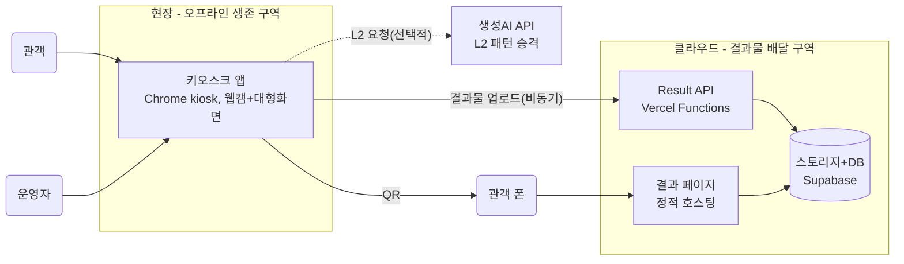
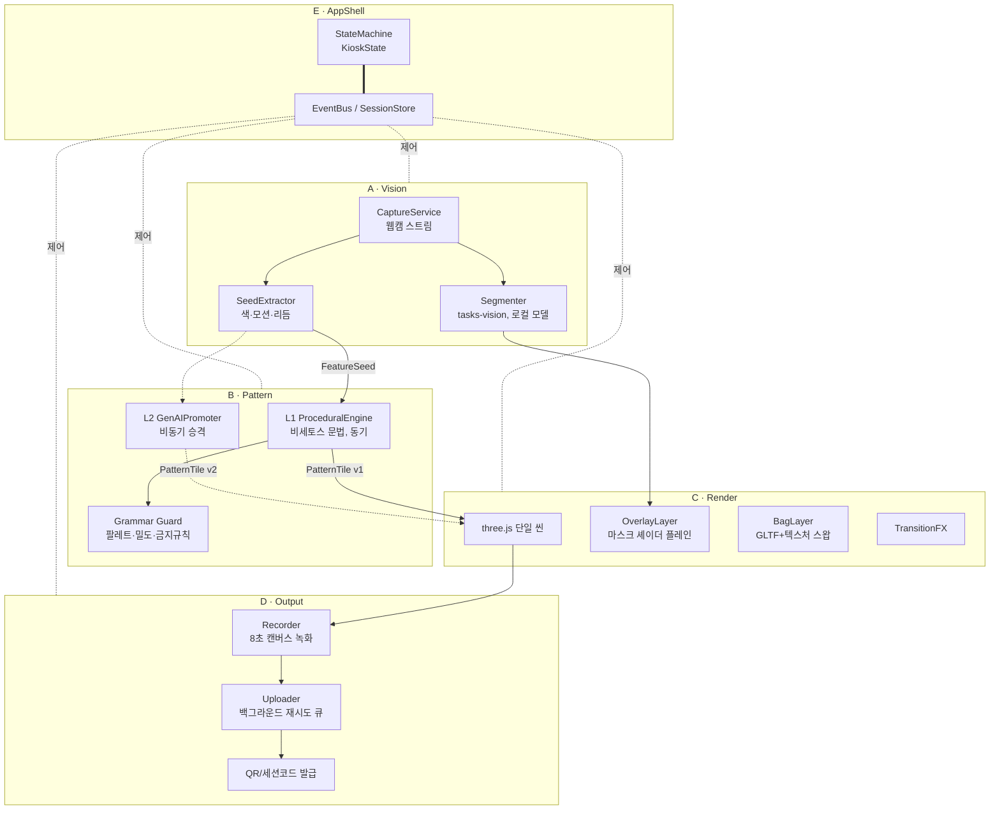
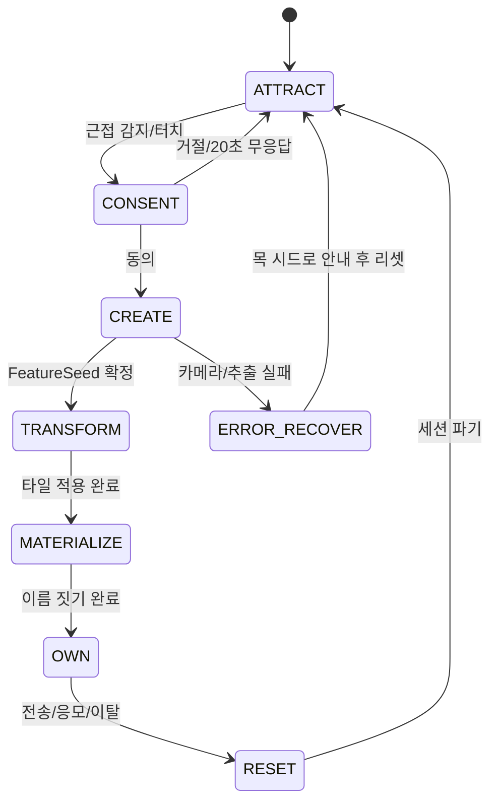
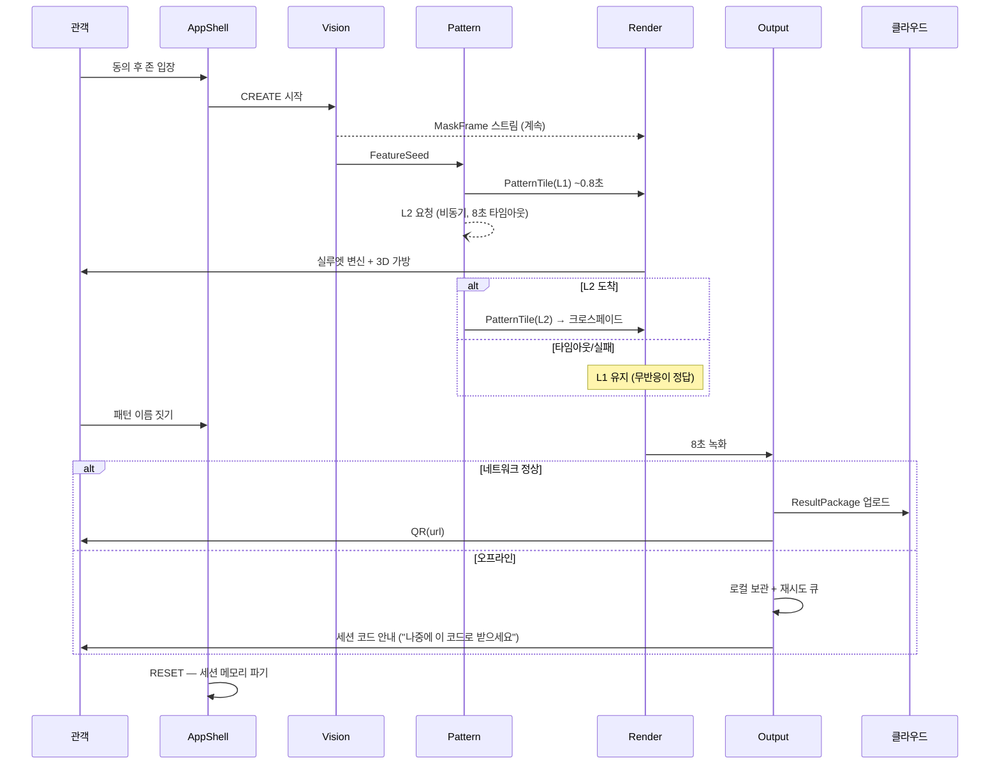

# 리빙 비세토스 — 아키텍처 설계서 v1

작성: 2026-08-13 · 팀 빽빽한하마 · 검토자: 전원 (ADR별 승인 필요)
관련 문서: `리빙비세토스_기획서.md`(무엇을) → **이 문서(어떻게)** → `DEV_SETUP.md`(누가·규칙)
다이어그램은 mermaid — 노션 코드 블록에서 언어를 Mermaid로 지정하면 렌더링됩니다.

---

## 1. 설계 원칙 4가지

1. **로컬 우선 (Local-first)** — 데모와 체험의 핵심 경로는 네트워크 없이 완주된다. 클라우드는 '있으면 더 좋은 것'에만 쓴다.
2. **계약이 국경** — 모듈은 `contracts.ts`의 타입으로만 대화한다. 구현은 자유, 국경 변경은 합의.
3. **무중단 품질 승격** — 빠르고 확실한 결과(L1)를 먼저 보여주고, 좋은 결과(L2)가 도착하면 소리 없이 갈아 끼운다. 관객은 기다리지 않는다.
4. **프라이버시 by design** — 원본 프레임은 어디에도 저장하지 않는다. 특징값·마스크·결과물만 존재한다.

---

## 2. 시스템 컨텍스트

키오스크는 독립 생존 가능하고, 클라우드는 '결과물 배달'만 담당한다.



- **현장 구역**: 카메라, 세그멘테이션, L1 패턴, 렌더, 녹화까지 전부 키오스크 로컬에서 동작.
- **클라우드 구역**: 관객 폰이 접근할 결과 페이지와 저장소. *키오스크가 아니라 폰 때문에 존재하는 구역*이다 — QR로 열 페이지는 인터넷에 있어야 하므로.
- **생성AI API**: L2 승격 전용. 죽어도 체험은 L1으로 완주.

---

## 3. 키오스크 런타임 컴포넌트



핵심: **렌더는 three.js 단일 씬으로 통합**한다(오버레이도 셰이더 플레인). v0 스켈레톤의 2D 캔버스 합성은 검증용이었고, 통합 씬이어야 오버레이→가방→전환 연출이 한 타임라인에서 논다.

---

## 4. 상태 머신 (E 모듈의 심장)



- 기획서의 5단계 여정에 **CONSENT를 정식 상태로 승격** — 동의 없이는 어떤 파이프라인도 시작되지 않는 것을 코드 구조로 보장.
- 모든 상태는 타임아웃을 가진다(무인 운영 대비). RESET에서 세션 메모리 전체 파기.

## 5. 데이터 플로우와 계약 (contracts.ts v1)

두 종류의 데이터를 구분한다: **스트림**(프레임 단위, 구독)과 **이벤트**(세션당 소수, 발행).

```ts
// ── 스트림 (30fps 목표) ──────────────────────────
export type MaskFrame = ImageBitmap;                    // Segmenter → OverlayLayer

// ── 이벤트 (세션당 1~수 회) ──────────────────────
export interface FeatureSeed {
  dominantColors: [string, string, string];
  motionEnergy: number;          // 0~1
  rhythm: number;                // 0~1
  sessionId: string;
}
export interface PatternTile {
  bitmap: ImageBitmap;           // 1024px 반복 타일
  version: 'L1' | 'L2';          // 무중단 승격의 키
  meta: { palette: string[]; spacing: number; motifDensity: number; seedRef: string };
}
export interface ResultPackage {
  sessionId: string;
  video: Blob;                   // 8초 세로 (mp4 우선, webm 폴백)
  posterImage: Blob;             // iOS 폴백 겸 썸네일
  certificate: { patternName: string; issuedAt: string; tileMeta: PatternTile['meta'] };
}
export type DeliveryTicket =
  | { kind: 'url'; url: string }          // 업로드 성공 → QR
  | { kind: 'code'; code: string };       // 오프라인 → 세션 코드 (나중 조회)

export type KioskState = 'ATTRACT'|'CONSENT'|'CREATE'|'TRANSFORM'|'MATERIALIZE'|'OWN'|'RESET'|'ERROR_RECOVER';
```

**L2 승격 프로토콜**: L1 타일 표시 직후 L2 요청 발사(타임아웃 8초). 도착 시 `PatternTile{version:'L2'}`를 같은 채널로 재발행 — 렌더는 버전만 보고 텍스처를 크로스페이드로 스왑. 실패·타임아웃 시 아무 일도 일어나지 않는다(L1 유지). **UI는 L2의 존재를 모른다.**

## 6. 대표 시퀀스 — 정상 + 두 가지 실패



## 7. 아키텍처 결정 기록 (ADR)

| # | 결정 | 이유 | 기각한 대안 | 대가(트레이드오프) |
| --- | --- | --- | --- | --- |
| 001 | 웹 + `chrome --kiosk`, Electron 보류 | 전 구간 웹 기술, 5인 DX 최우선 | Electron 선행 도입 | 부스 상설 시 마지막 주 래핑 작업 1일 |
| 002 | 패턴 엔진 2단 (L1 동기 + L2 비동기 승격) | 반응성·생존성과 품질을 분리 | 생성AI 단독 | L1 문법 구현 공수 |
| 003 | 세그멘테이션은 tasks-vision + **모델 파일 로컬 번들** | v0의 CDN 방식은 오프라인 불가. 로컬 모델로 원칙 1 달성 | classic selfie_segmentation CDN | 초기 로딩 관리, 번들 크기 ↑ |
| 004 | 렌더는 three.js 단일 씬 (오버레이=셰이더 플레인) | 오버레이·가방·전환을 한 타임라인에서 연출, GPU 일원화 | 2D 캔버스 합성 유지 | 셰이더 학습 곡선 (C 담당 스파이크) |
| 005 | 결과물 전달은 로컬 우선 — 백그라운드 업로드, 실패 시 세션 코드 | QR용 페이지는 인터넷 필수 ← 유일한 클라우드 의존을 격리 | 실시간 업로드 필수화 | 코드 조회 UX 추가 구현 |
| 006 | 클라우드는 Vercel(정적+함수) + Supabase(스토리지·DB) | 무료 티어, 팀 친숙도, 운영 부담 최소 | 자체 서버 | 벤더 종속(해커톤 수준에선 무시 가능) |
| 007 | 영상은 mp4(h264) 지원 시 우선, 아니면 webm + 포스터 이미지 폴백 | iOS 사파리 webm 미재생 문제 선제 대응 | 서버 트랜스코딩 | 폴백 분기 코드 |

## 8. 성능 예산 (넘으면 이슈 등록)

| 구간 | 목표 | 측정 방법 |
| --- | --- | --- |
| 부팅 → ATTRACT | < 10초 | 콘솔 타임스탬프 |
| 마스크 스트림 | 24fps 이상 @720p | 렌더 루프 카운터 |
| FeatureSeed 추출 | < 1.5초 | CREATE 구간 로그 |
| L1 타일 생성 | < 0.8초 | 〃 |
| L2 승격 | < 8초 (초과 시 포기) | 타임아웃 로그 |
| 세션 전체 | ≤ 90초 | 상태머신 타이머 |

## 9. 폴백 매트릭스 (데모 생존 설계)

| 상황 | 감지 | 동작 | 관객이 보는 것 |
| --- | --- | --- | --- |
| 인터넷 없음 | 업로드 실패 | 재시도 큐 + 세션 코드 발급 | 정상 체험, "코드로 받아가세요" |
| 생성AI 장애 | L2 타임아웃 | L1 유지 | 아무 차이 모름 |
| 카메라 실패 | getUserMedia 예외 | 목 마스크·목 시드 데모 모드 | 운영자 안내 후 시연 계속 |
| 조명 열악 | 마스크 신뢰도 저하 | 대비 보정 + 오버레이 불투명도 조정 | 품질 저하만 |
| 전체 장애 | 운영자 판단 | 사전 녹화 영상 재생 (단축키) | 데모 영상 |

## 10. 리포 매핑 (DEV_SETUP 연결)

| 폴더 | 컴포넌트 | 모듈 |
| --- | --- | --- |
| `src/app/` | StateMachine, EventBus, SessionStore | E |
| `src/vision/` | CaptureService, Segmenter, SeedExtractor | A |
| `src/pattern/` | L1 Engine, Grammar Guard, L2 Promoter | B |
| `src/render/` | Scene, OverlayLayer, BagLayer, TransitionFX | C |
| `src/output/` | Recorder, Uploader, QR/Code | D |
| `cloud/` | Vercel functions, 결과 페이지 | D(+E) |
| `public/models/` | 세그멘테이션 모델 파일 (로컬 번들) | A |
| `public/assets/` | 가방 GLTF, 폰트 | C |

## 11. v0 스켈레톤 → v1 이행 순서

1. 리포 생성 + `contracts.ts` v1 커밋 (E) — *이 문서 5장 그대로*
2. A: classic CDN → tasks-vision + 로컬 모델 교체 (ADR-003)
3. C: 2D 합성 → three.js 씬에 오버레이 플레인 통합 (ADR-004)
4. B: `generateTile` 이식 후 문법 파라미터화 + Grammar Guard 분리
5. E: 전역 상태 `S` → StateMachine + EventBus (4장 다이어그램 그대로)
6. D: Recorder 스파이크 → Uploader/세션 코드 (ADR-005~007)
7. 첫 통합의 날: 폴백 매트릭스 5행을 실제로 유발시켜보는 '고장 리허설' 포함

---

### 팀 리뷰 요청

- [ ] ADR-003/004 승인 — A·C 담당자 (작업량에 직접 영향)
- [ ] 세션 코드 UX 문구 — 기획
- [ ] Supabase vs Firebase — D 담당자 취향 반영 가능 (ADR-006 수정 가능)
- [ ] 성능 예산 수치 현실성 — 첫 스파이크 후 재조정
